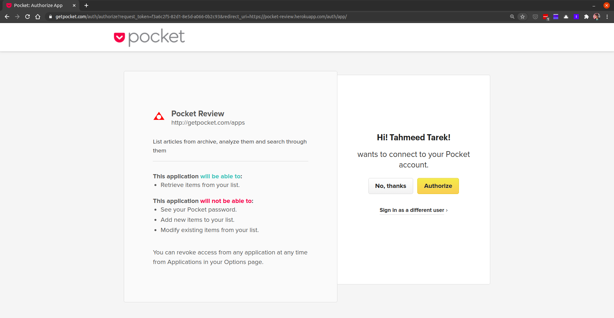
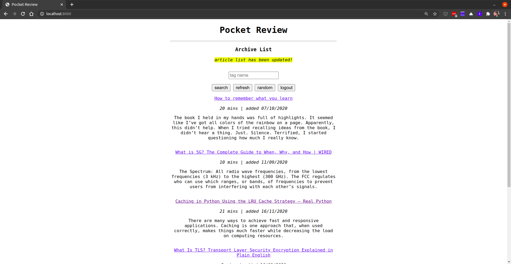

# Pocket Review

<p align="center">
  
</p>


A tool to take a look at [Pocket](https://app.getpocket.com/) archive.  The goal is to resurface random articles and derive insights about particular reading patterns. Link to [Demo](https://pocket-review.herokuapp.com/).

## Feature List

- Basic list of archive items - **DONE!**
- List with tag filters, article metadata - **DONE!**
- Random article, filtered by tag - **DONE!**
- Caching list of articles, by user & tag - **DONE!**
- Authentication with Pocket - **DONE!**
- Deploy to Heroku - **DONE!**
- Categorize via similarities (title, site, text)

## Tech Stack

- Django
- [Pocket API](https://getpocket.com/developer/docs/overview)
- Postman - API Testing
- Heroku

## Screenshots




## Setup

```bash
# perform migrations
python manage.py migrate

# setup cache table in database
python manage.py createcachetable

# set key obtained from Pocket 
export CONSUMER_KEY=<key>

# set redirect_uri (callback link after auth) at views.auth_user
# if DJANGO_DEBUG == 1: redirect_uri=http://localhost:8000/auth/app/
# else redirect_uri='https://pocket-review.herokuapp.com/auth/app/'
export DJANGO_DEBUG=1

```
